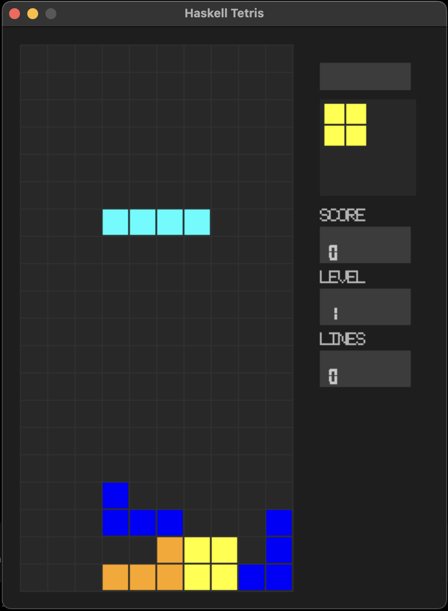

# Haskell Tetris

[](https://www.haskell.org/)
[](https://opensource.org/licenses/MIT)
[](https://github.com/JohnVonDrashek/haskell-tetris/actions)

A pure functional Tetris clone written in Haskell using SDL2 for rendering.



## Features

- Classic Tetris gameplay on a 10x20 board
- Clean separation between pure game logic and I/O (rendering/input)
- Time-based gravity system with increasing speed per level
- Next piece preview panel
- Custom seven-segment display rendering for score, level, and lines
- All 7 standard Tetromino pieces with rotation
- Comprehensive test suite (31 tests)

## Why Haskell?

This project demonstrates idiomatic functional programming in Haskell:

- **Pure game logic** - All game state transitions are pure functions, making the code easy to test and reason about
- **Separation of concerns** - I/O (SDL2 rendering, input handling) is cleanly separated from the core logic
- **Type safety** - Haskell's type system catches bugs at compile time
- **Immutable data structures** - Game state is never mutated, only transformed

## Installation

### Prerequisites

- [GHC](https://www.haskell.org/ghc/) (>= 9.0 recommended)
- [Cabal](https://www.haskell.org/cabal/) (>= 3.0)
- SDL2 development libraries

#### macOS

```bash
brew install sdl2
```

#### Ubuntu/Debian

```bash
sudo apt-get install libsdl2-dev
```

### Build

```bash
cabal build
```

### Run

```bash
cabal run
```

### Test

```bash
cabal test
```

## Controls

| Key | Action |
|-----|--------|
| Left Arrow | Move piece left |
| Right Arrow | Move piece right |
| Down Arrow | Soft drop |
| Up Arrow | Rotate piece |
| Space | Hard drop |
| Escape / Q | Quit game |

## Project Structure

```
src/
  Tetris/
    Types.hs    -- Core data types (GameState, Piece, Board)
    Pieces.hs   -- Tetromino definitions and rotation
    Logic.hs    -- Pure game logic (movement, collision, line clearing)
    Render.hs   -- SDL2 rendering
    Input.hs    -- Input handling
app/
  Main.hs       -- Game loop and initialization
test/
  Spec.hs       -- Test runner
  LogicSpec.hs  -- Game logic tests
```

## License

MIT
